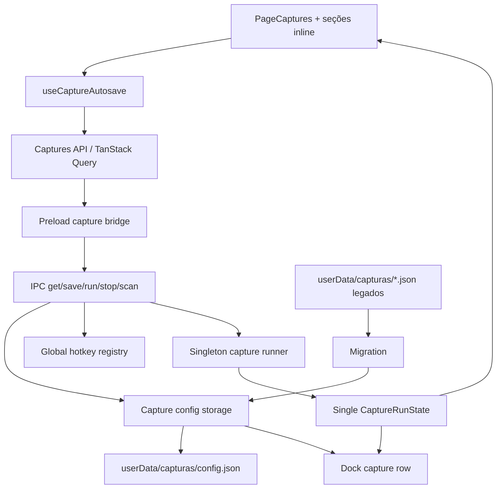
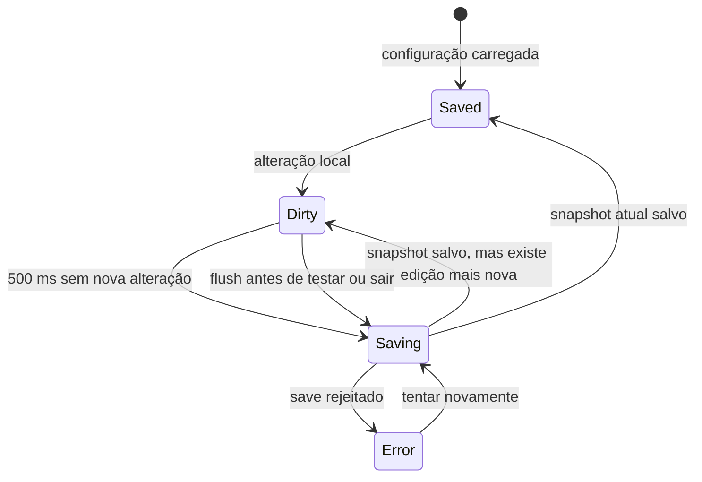
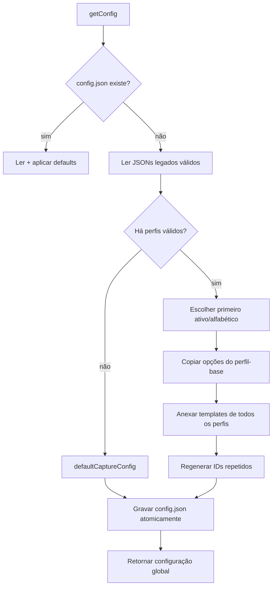

# Design: Capturas unificadas

**Spec:** `.specs/features/capturas-unificadas/spec.md`
**Context:** `.specs/features/capturas-unificadas/context.md`
**Status:** Approved

---

## Architecture Overview

A implementação substitui `CaptureProfile` por um singleton persistido `CaptureConfig`. A API deixa de listar e endereçar perfis por ID: renderer, dock, IPC, hotkeys e runner passam a ler, salvar e executar a mesma configuração global. A primeira leitura cria `config.json`, migrando todos os templates legados quando necessário.



## Chosen Approach

**Configuração global real.** `CaptureProfile`, APIs de lista/exclusão e estado indexado por `profileId` serão removidos. Um adaptador de perfil único ou uma agregação apenas visual deixariam o modelo antigo ativo e permitiriam inconsistência entre tela, dock, atalhos e armazenamento.

## Code Reuse Analysis

### Existing Components to Leverage

| Component | Location | How to Use |
| --- | --- | --- |
| `TemplateList` | `src/features/captures/components/template-list.tsx` | Continuar editando a lista global de templates diretamente na página. |
| `HotkeyCapture` | `src/components/hotkey-capture/hotkey-capture.tsx` | Configurar atalho global e tecla da pokébola. |
| `SettingsRow` e `Card` | `src/components` | Montar as seções Disparo, Área e Avançado no padrão visual existente. |
| `RegionPickerField` | `src/features/captures/components/region-picker-field.tsx` | Editar área principal e exclusões. |
| `PointPickerField` | `src/features/captures/components/point-picker-field.tsx` | Editar estacionamento fixo do cursor. |
| `ScanPreviewDialog` | `src/features/captures/components/scan-preview-dialog.tsx` | Exibir o preview, trocando a prop de perfil para configuração. |
| Validação de conflitos | `electron/engine/hotkeys.ts` | Preservar mensagens e precedência entre pânico, macros e Capturas. |
| Defaults e limites | `shared/capture-types.ts` | Manter todos os valores e limites atuais sob `defaultCaptureConfig`. |
| TanStack Query | `src/features/captures/api/index.ts` | Buscar configuração, salvar snapshots e atualizar cache. |

### Integration Points

| System | Integration Method |
| --- | --- |
| Processo main | IPC singleton sem argumento de ID para get/run/stop/scan. |
| Hotkeys globais | Uma entrada opcional de Capturas sincronizada após cada save válido. |
| Dock lateral | Uma linha fixa de Capturas com atalho, executar, testar e ativar. |
| Motor de visão | Recebe os mesmos templates e opções; nenhuma mudança no algoritmo. |
| Filesystem local | `config.json` gravado de forma atômica; perfis legados lidos apenas durante migração. |

---

## Components

### CaptureConfig contract

- **Purpose:** Representar toda a configuração global sem identidade ou nome de perfil.
- **Location:** `shared/capture-types.ts`
- **Interfaces:**
  - `CaptureConfig` mantém os campos atuais de `CaptureProfile`, exceto `id` e `name`.
  - `defaultCaptureConfig(): CaptureConfig` cria estado inativo e lista vazia.
  - `CaptureRunState` contém apenas `status` e `lastRun`.
- **Dependencies:** `Region`, `CaptureTemplate` e enums existentes.
- **Reuses:** Defaults, bounds e comentários do contrato atual.

### Migration helpers

- **Purpose:** Selecionar a configuração-base, reunir templates e resolver IDs repetidos de forma determinística e testável.
- **Location:** `electron/engine/capture-config-migration.ts`
- **Interfaces:**
  - `migrateProfiles(profiles: LegacyCaptureProfile[], createId: () => string): CaptureConfig`
  - `selectBaseProfile(profiles: LegacyCaptureProfile[]): LegacyCaptureProfile | undefined`
- **Dependencies:** Tipos compartilhados; não importa Electron nem filesystem.
- **Reuses:** `defaultCaptureConfig` e o formato legado documentado localmente.

### Capture config storage

- **Purpose:** Ler, normalizar, migrar e gravar o singleton.
- **Location:** `electron/engine/capture-storage.ts`
- **Interfaces:**
  - `getConfig(): CaptureConfig`
  - `saveConfig(config: CaptureConfig): CaptureConfig`
- **Dependencies:** Electron `app`, filesystem e migration helpers.
- **Reuses:** Diretório atual `userData/capturas`.
- **Persistence:** Grava `config.json.tmp` e renomeia para `config.json`; uma configuração existente impede nova migração.

### Capture IPC and preload bridge

- **Purpose:** Expor operações singleton ao renderer e ao dock.
- **Locations:** `shared/ipc-channels.ts`, `electron/ipc.ts`, `electron/preload.ts`
- **Interfaces:**
  - `capture.get(): Promise<CaptureConfig>`
  - `capture.save(config): Promise<CaptureConfig>`
  - `capture.run(): Promise<void>`
  - `capture.stop(): Promise<void>`
  - `capture.scanPreview(includeImage?): Promise<CaptureScanPreview>`
  - `capture.onChanged(listener: (config) => void)`
  - `capture.onState(listener: (state) => void)`
- **Dependencies:** storage, hotkeys, runner, vision and window management.
- **Reuses:** Broadcast e tratamento de preview atuais.

### Singleton hotkey and runner

- **Purpose:** Registrar e executar apenas a configuração global.
- **Locations:** `electron/engine/hotkeys.ts`, `electron/engine/capture-runner.ts`
- **Interfaces:**
  - `syncHotkeys(macros, captureConfig, settings)`
  - `assertNoCaptureHotkeyConflict(config)`
  - `triggerCapture(config, source)`
  - `stopCapture()`, `resetCaptureCooldown()` e `isCaptureRunning()` sem ID.
- **Dependencies:** storage, key maps, vision and input automation.
- **Reuses:** Toda a lógica de foco, cooldown, passadas, loop e estacionamento existente.

### Autosave coordinator

- **Purpose:** Manter o draft da tela e serializar saves para que o snapshot mais novo sempre prevaleça.
- **Location:** `src/features/captures/hooks/use-capture-autosave.ts`
- **Interfaces:**
  - `draft`, `patch`, `status`, `error`, `retry`, `flush`.
- **Dependencies:** `useCaptureConfig`, `useSaveCaptureConfig`, timers and React lifecycle.
- **Reuses:** TanStack Query para cache e mutação.
- **Ordering:** Um timer de 500 ms cria o snapshot pendente. Existe no máximo um save em voo; quando termina, o coordenador salva imediatamente qualquer snapshot mais novo já aguardando.

### Unified Captures page

- **Purpose:** Exibir configuração, salvamento e operação em um único contexto.
- **Location:** `src/features/captures/page-captures.tsx`
- **Composition:**
  - `capture-pokemon-section.tsx`
  - `capture-trigger-section.tsx`
  - `capture-area-section.tsx`
  - `capture-advanced-section.tsx`
- **Dependencies:** autosave coordinator, state hook and scan preview.
- **Reuses:** `TemplateList`, pickers, cards, settings rows, buttons and notifications.
- **Layout:** Duas colunas no desktop; coluna única no viewport estreito. Avançado usa conteúdo recolhível, sem abas.

### Dock singleton row

- **Purpose:** Preservar ativação, execução e teste no dock sem listar perfis.
- **Location:** `electron/dock-window.ts`
- **Dependencies:** preload singleton bridge.
- **Reuses:** HTML e handlers atuais, reduzidos a uma linha fixa.

---

## Data Models

### CaptureConfig

```typescript
type CaptureConfig = {
  hotkey?: string
  active: boolean
  templates: CaptureTemplate[]
  scanRegion?: Region
  excludeRegions: Region[]
  ballKey: string
  clickAfterKey: boolean
  maxTargets: number
  delayBeforeKeyMs: number
  delayBetweenTargetsMs: number
  rescanPasses: number
  rescanDelayMs: number
  targetCooldownMs: number
  cooldownRadiusPx?: number
  maxOverlap: number
  parking: CaptureParking
  parkingPoint?: { x: number; y: number }
  requireGameFocus: boolean
  gameWindowTitle?: string
  mode: CaptureMode
  loopIntervalMs: number
}
```

### CaptureRunState

```typescript
type CaptureRunState = {
  status: "idle" | "scanning" | "acting"
  lastRun?: CaptureRunSummary
}
```

### LegacyCaptureProfile

Formato interno aceito somente pela migração. Preserva `id` e `name` para ordenar e ler arquivos antigos; não é exportado para renderer nem reutilizado no novo domínio.

---

## Autosave State Flow



- O cache só recebe um snapshot confirmado pelo processo main.
- O draft nunca é substituído por uma resposta mais antiga quando já existe revisão local posterior.
- `flush()` cancela o debounce, aguarda a fila até a revisão mais recente e rejeita se essa revisão não puder ser salva.
- “Testar detecção” chama `flush()` antes do IPC de scan.

---

## Migration Flow



Arquivos ilegíveis são registrados e ignorados. Os legados não são removidos. Depois que `config.json` existe, a migração não roda novamente.

---

## Error Handling Strategy

| Error Scenario | Handling | User Impact |
| --- | --- | --- |
| Conflito de atalho | Main rejeita o save antes de persistir | Draft permanece; estado vira erro com a mensagem atual e retry. |
| Falha de escrita | Arquivo temporário não substitui o último snapshot válido | Tela mantém alterações e oferece retry. |
| Edição durante save | Guarda o snapshot mais novo e o salva depois do atual | Nenhuma edição antiga sobrescreve a mais recente. |
| Perfil legado ilegível | Loga o nome do arquivo e continua com os demais | Pokémon de arquivos válidos continuam migrados. |
| Teste com save falhando | `flush()` rejeita e não inicia scan | Usuário vê o erro de salvamento; teste não usa valores antigos silenciosamente. |
| Nenhum template utilizável | Preserva o resultado `no-templates` e desabilita preview | Sem disparos inesperados. |

---

## Risks & Concerns

| Concern | Location | Impact | Mitigation |
| --- | --- | --- | --- |
| O dock mantém uma segunda UI baseada em lista de perfis | `electron/dock-window.ts:209` | A tela principal poderia ficar correta enquanto o dock quebra ou opera dados antigos. | Incluir o dock no mesmo contrato singleton e no UAT. |
| Saves concorrentes não são serializados atualmente | `src/features/captures/api/index.ts:16` | Uma resposta antiga pode prevalecer sobre uma edição nova no autosave. | Coordenador com uma operação em voo e snapshot pendente mais recente. |
| Storage atual faz escrita direta e parse sem isolamento | `electron/engine/capture-storage.ts:22` | Arquivo parcial ou legado inválido pode impedir Capturas de carregar. | Escrita temp+rename; leitura legada por arquivo com log e continuidade. |
| Runner usa mapas e sets por ID em muitos pontos | `electron/engine/capture-runner.ts:20` | Remover ID parcialmente deixaria estado e cooldown incoerentes. | Converter todo o runner para estado singleton em uma tarefa dedicada. |
| Não há test runner configurado no projeto | `package.json` | Migração e ordenação de autosave podem regredir sem detecção. | Adicionar Vitest para lógica pura e completar com build/lint e UAT do Electron. |
| Alterações locais do usuário coincidem com arquivos afetados | `shared/capture-types.ts`, `electron/ipc.ts`, `electron/preload.ts` | Implementação pode sobrescrever trabalho em andamento. | Reconciliar o diff antes de cada tarefa; nunca restaurar ou substituir o arquivo inteiro. |

---

## Tech Decisions

| Decision | Choice | Rationale |
| --- | --- | --- |
| Modelo interno | `CaptureConfig` singleton sem `id`/`name` | Reflete a experiência aprovada e elimina compatibilidade enganosa. |
| Arquivo canônico | `userData/capturas/config.json` | Mantém dados próximos dos legados e permite migração detectável por existência. |
| Escrita | Snapshot completo com temp+rename | Evita configuração parcialmente gravada. |
| Autosave | Debounce de 500 ms + fila latest-wins | Reduz I/O e resolve ordering sem paralelismo. |
| Migração | Função pura separada do filesystem | Permite cobrir seleção, união e IDs duplicados com testes determinísticos. |
| UI | Seções inline e Avançado recolhível | Entrega acesso direto sem sobrecarregar o primeiro nível. |
| Engine | Preservar algoritmo e parâmetros atuais | Limita risco e mantém o escopo na experiência/configuração. |

---

## Requirement Coverage

| Area | Requirements | Design owner |
| --- | --- | --- |
| Página e layout | CAP-01–CAP-07, CAP-27–CAP-28 | Unified page + section components |
| Autosave e conflitos | CAP-08–CAP-14, CAP-29–CAP-30 | Autosave coordinator + IPC save |
| Migração | CAP-15–CAP-20 | Migration helpers + storage |
| Operação | CAP-21–CAP-26 | IPC/preload + runner + state + dock |
